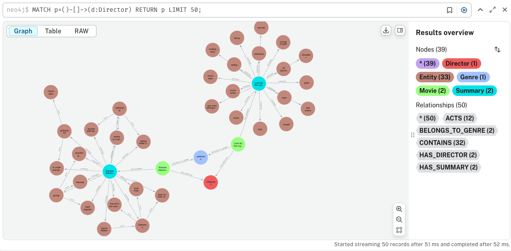

# Structured RAG: Leveraging Knowledge Graphs for Intelligent Querying

## Overview
This project builds a **Retrieval-Augmented Generation (RAG)** model that leverages a **structured knowledge graph** for querying movie-related data. Instead of using vector-based retrieval, the system employs a **graph-based approach** using **Neo4j** and **LLM-powered structured query generation** to retrieve information. The movie dataset is processed into structured triplets, stored in a knowledge graph, and queried efficiently using Cypher queries.

## Pipeline
The project is divided into three major phases:

### **Phase 1: Data Processing & Triplet Extraction**
1. **Preprocessing Movie Database:**
   - Load and clean the original dataset (`cleaned_wiki_movie_plots.csv`).
   - Extract relevant columns such as **Title, Director, Cast, Genre, and Plot**.
2. **Entity Extraction:**
   - Pass the **plot summaries** to an **LLM** to extract triplets. The idea was taken from the paper titled "Extract, Define, Canonicalize: An LLM-based Framework for Knowledge
Graph Construction" by Bowen Zhang1 and Harold Soh1. Idea was to extract text in the format of a triplet as `[(Subject, Relation, Object)]`.
   - Triplets represent relationships like `(Movie)-[:HAS_ACTOR]->(Actor)`.

### **Phase 2: Knowledge Graph Construction**
1. **Connection Test with Neo4j:**
   - Validate database connectivity.
2. **Graph Generation:**
   - Convert extracted triplets into **nodes and relationships** in **Neo4j**.
   - Define schema:
     - `(:Movie)-[:HAS_SUMMARY]->(:Summary)`
     - `(:Movie)-[:HAS_DIRECTOR]->(:Director)`
     - `(:Movie)-[:BELONGS_TO_GENRE]->(:GENRE)`
     - `(:Summary)-[:CONTAINS]->(:Entity)`
     - `(:Entity1)-[:ACTS]->(:Entity2)`
   - Store the structured graph in Neo4j.

   A sample schmea from Neo4j is pasted below.
   

### **Phase 3: Structured Query Retrieval (RAG Model)**
1. **Query Processing:**
   - Takes an **unstructured natural language query**.
   - Passes it to the **LLM**, along with the **graph schema**.
   - LLM translates it into a **Cypher query**. Example of cypher query is: `MATCH p=(m:Movie {year: 1925})-[:HAS_DIRECTOR]->(d:Director {name: "King Vidor"}) RETURN p;`
2. **Retrieval from Neo4j:**
   - Executes the **generated Cypher query** on the **Neo4j database**.
   - Fetches relevant structured results.
3. **Final Output:**
   - Returns structured movie data in a human-readable format.

## Final Product
- A **graph-based RAG model** that efficiently retrieves structured movie knowledge.
- Ability to answer **multihop queries** like:
  - "Find all movies directed by Christopher Nolan."
  - "List movies where Leonardo DiCaprio has acted."
- No dependency on **vector search** or **semantic retrieval**, ensuring high precision from structured data.

## Tech Stack
- **Python**: Core language for data processing, API calls, and retrieval logic
- **Neo4j**: Graph database for structured movie knowledge representation
- **OpenAI API**: LLM-powered entity extraction and structured query generation
- **Pandas**: Data preprocessing and cleaning
- **JSON**: Storage format for extracted triplets
- **Cypher**: Query language for Neo4j
- **Git**: Version control

---
This project serves as foundation for **RAG-based knowledge retrieval using structured databases**. 🚀

